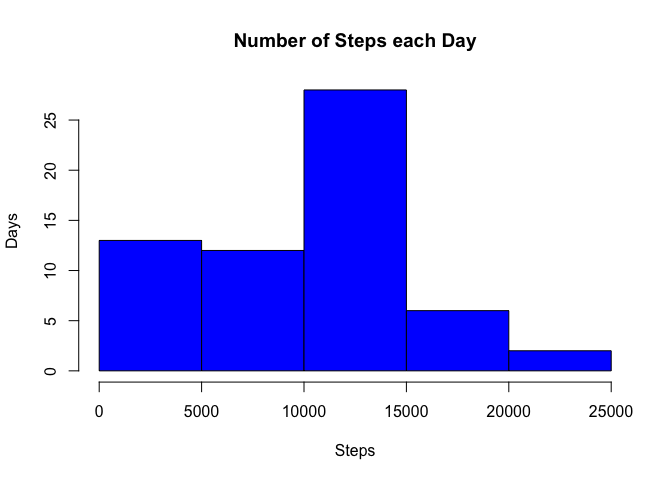
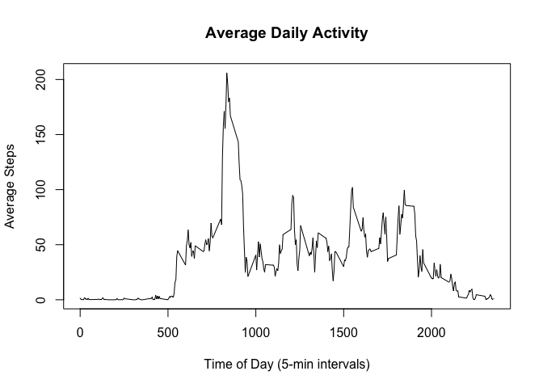
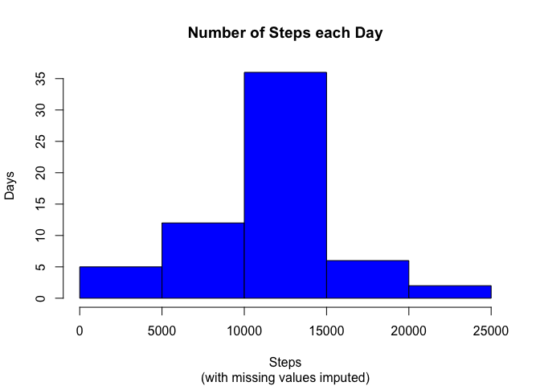
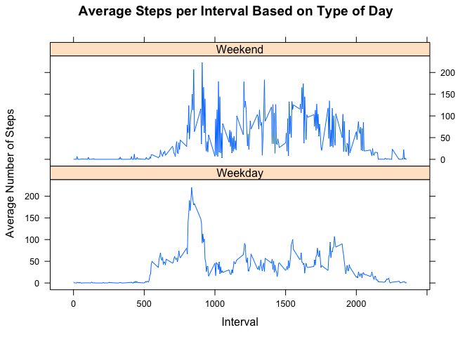

# Reproducible Research: Peer Assessment 1


## Loading and preprocessing the data
#### Read data

```r
setwd("/Users/samuelshaw/CourseraProjects/RepData_PeerAssessment1")
activity<-read.csv("activity.csv")
```

#### Packages

```r
library(knitr)
library(dplyr)
library(lattice)
```

#### Remove NAs

```r
activity<-activity[!is.na(activity$steps),]
```


## What is mean total number of steps taken per day?
#### Calculate the total number of steps each day

```r
daysteps<-data.frame(with(activity, xtabs(steps~date)))
colnames(daysteps)<-c("Date", "Steps")
head(daysteps)
```

```
##         Date Steps
## 1 2012-10-01     0
## 2 2012-10-02   126
## 3 2012-10-03 11352
## 4 2012-10-04 12116
## 5 2012-10-05 13294
## 6 2012-10-06 15420
```

#### Histogram of total steps taken each day

```r
hist(daysteps$Steps, 
     col="blue", ylab="Days", xlab="Steps", 
     main="Number of Steps each Day")
```

<!-- -->

#### But... does the question ask for EACH day?
#### This barplot (not shown) does that

```r
barplot(daysteps$Steps, xlab="Day", ylab="Total Steps", main="Steps EACH Day")
```

#### Mean number of Steps taken each day

```r
mean(daysteps$Steps)
```

```
## [1] 9354.23
```
#### Median number of Steps taken each day

```r
median(daysteps$Steps)
```

```
## [1] 10395
```


## What is the average daily activity pattern?
#### Make a time series plot of the 5-minute interval and the average number of steps taken, averaged across all days. 

```r
intervals<-group_by(activity, interval)
interAvg<-summarize(intervals, mean(steps))
plot(interAvg, type="l", 
     xlab="Time of Day (5-min intervals)", ylab="Average Steps", 
     main="Average Daily Activity")
```

<!-- -->

#### Which 5-minute interval, on average across all the days in the dataset, contains the maximum number of steps?

```r
interAvg[interAvg$`mean(steps)`==max(interAvg$`mean(steps)`), 1]
```

```
## # A tibble: 1 x 1
##   interval
##      <int>
## 1      835
```


## Imputing missing values
#### Calculate and report the total number of missing values in the dataset (i.e. the total number of rows with NAs)
#### Reproduce original dataset

```r
activity1<-read.csv("activity.csv")
```
#### Check for NAs

```r
any(is.na(activity1$steps))
```

```
## [1] TRUE
```

```r
any(is.na(activity1$interval))
```

```
## [1] FALSE
```

```r
any(is.na(activity1$date))
```

```
## [1] FALSE
```
#### Count number of NA rows in columns where data are missing

```r
nrow(activity1[is.na(activity1$steps),])
```

```
## [1] 2304
```

#### Devise a strategy for filling in all of the missing values in the dataset
#### Lets keep it simple and use the interval averages calculated above

```r
NAs<-activity1[is.na(activity1$steps), ]
act2<-merge(interAvg, NAs, by="interval")
act3<-act2[ , c(2,4,1)]
colnames(act3)<-c("steps", "date", "interval")
```

#### Create a new dataset that is equal to the original dataset but with the missing data filled in

```r
act4<-rbind(activity, act3)
act4<-arrange(act4, date, interval)
```

#### Make a histogram of the total number of steps taken each day and calculate and report the mean and median total number of steps taken per day

```r
newdaysteps<-data.frame(with(act4, xtabs(steps~date)))
colnames(newdaysteps)<-c("Date", "Steps")
```

##### Histogram

```r
hist(newdaysteps$Steps, 
     col="blue", ylab="Days", xlab="Steps", 
     main="Number of Steps each Day", sub="(with missing values imputed)")
```

<!-- -->

##### Mean and Median

```r
mean(newdaysteps$Steps)
```

```
## [1] 10766.19
```

```r
median(newdaysteps$Steps)
```

```
## [1] 10766.19
```

#### Do these values differ from the estimates from the first part of the assignment? What is the impact of imputing missing data on the estimates of the total daily number of steps?
##### The impact of imputing data is that the measures of central tendency increase. In fact, the mean and median are the same now, because it is this same number (the daily average) that has been substituted for days with missing values. 


## Are there differences in activity patterns between weekdays and weekends?
#### Use weekdays() to create a 'day-of-the-week' variable

```r
act4$day<-weekdays(as.Date(act4$date))
```

#### Create a new factor variable in the dataset with two levels – “weekday” and “weekend” indicating whether a given date is a weekday or weekend day

```r
act4$weekend<-as.factor(ifelse(act4$day==c("Saturday", "Sunday"), 
                               "Weekend", "Weekday"))
```

#### Make a panel plot containing a time series plot of the 5-minute interval and the average number of steps taken, averaged across all weekday days or weekend days

```r
intervals2<-group_by(act4, interval, weekend)
interAvg2<-summarize(intervals2, Avgsteps=mean(steps))
xyplot(Avgsteps~interval|weekend, data=interAvg2, type="l",  layout = c(1,2),
       main="Average Steps per Interval Based on Type of Day", 
       ylab="Average Number of Steps", xlab="Interval")
```

<!-- -->


